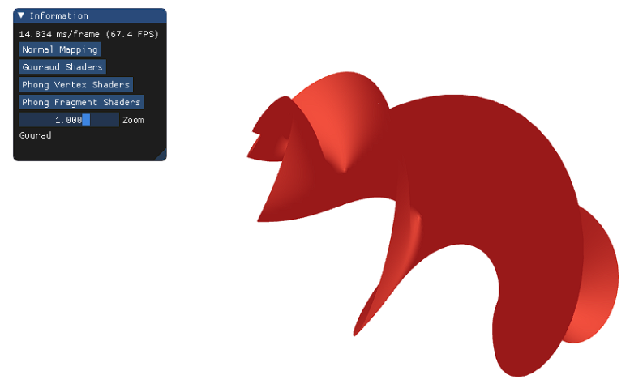
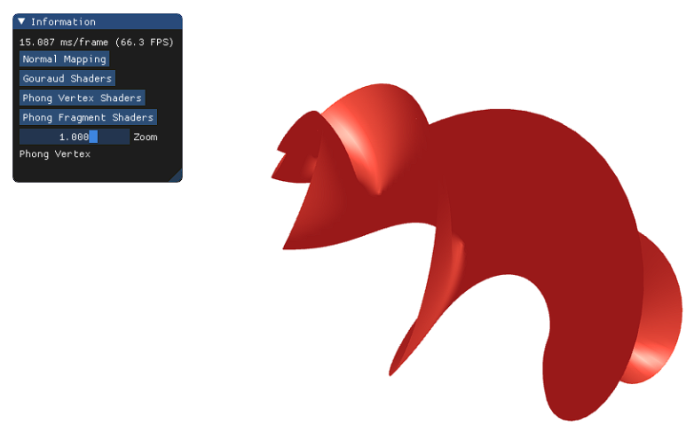
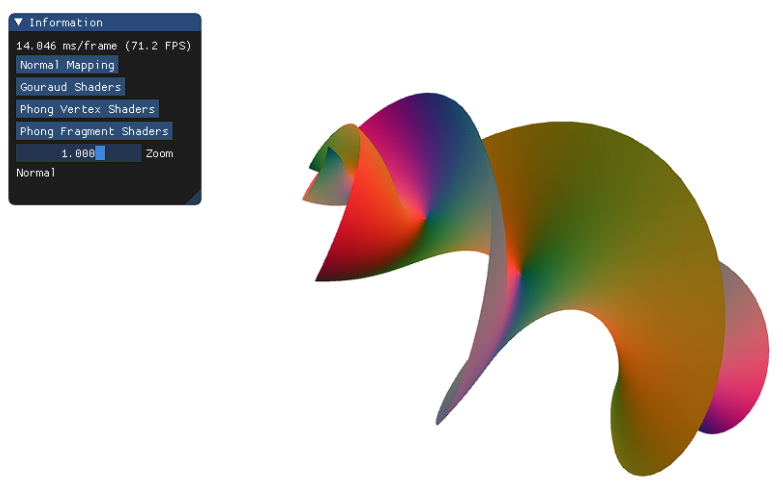

# Parametric Surface generation and shading


The parametric surface used is HyperHelicoidal.<br>
HyperHelicoidal parametric equation is:<br>
` x = (sinh(v)*cos(3*u))/(1+cosh(u)*cosh(v)) `<br>
` y = (sinh(v)*sin(3*u))/(1+cosh(u)*cosh(v)) `<br>
` z = (cosh(v)*sinh(u))/(1+cosh(u)*cosh(v)) `<br>


For info on HyperHelicoidal, reference:  [scientificlib.com - Hyperhelicoidal](http://www.scientificlib.com/en/Mathematics/Surfaces/Hyperhelicoidal.html)

## Modelling
The first thing we need to do is to get the coordinates of the vertices of the surface we need to plot. 
To get the coordinates, we can vary the two parameters (u, v) in the equation of the curve and get the coordinates of the vertices with that. 
This can be implemented using a nested for-loop where we can fix one parameter (u, in this case) and iterate over the vertices generated by varying the other parameter (v).

What we get is a grid of points of ` U_COUNT ` by ` V_COUNT ` size. <br>
Now since we have the vertex coordinates, the next step is to plot them. To plot them, we have to push the coordinates into the Vertex Buffer Object (Abstracted using Vertex Array Object (VAO) in OpenGL). <br>
We need to push the coordinates in order such that every 3 coordinate forms a triangle that is a part of the mesh that will cover the surface. For that, we devise a small procedure that can triangulate on the grid of points that we have.<br>

Triangulation Procedure:

``` 
For pu in U_COUNT-1:
	For pv in V_COUNT-1:
		array.push(pu,v);
		array.push(pu+1,v);
		array.push(pu+1,v+1);
		array.push(pu+1,v+1);
		array.push(pu,v+1);
		array.push(pu,v);
```


With this procedure, we can tile the whole surface using squares that are made with a series of triangles. <br>
` The size of the array = 3*6*(U_COUNT-1)*(V_COUNT-1) `. Since we add 6 points per iteration and we iterate ` (U_COUNT-1)*(V_COUNT-1) ` times.

Generated Shape:<br>
<br>

## Lighting and Shading
To do lighting and shading computations, we need to use the normals at every point in the shaders and manipulate them using the light and camera position to display a certain color at a pixel.

The parametric surface used is HyperHelicoidal.<br>
HyperHelicoidal parametric equation is:<br>
` x = (sinh(v)*cos(3*u))/(1+cosh(u)*cosh(v)) `<br>
` y = (sinh(v)*sin(3*u))/(1+cosh(u)*cosh(v)) `<br>
` z = (cosh(v)*sinh(u))/(1+cosh(u)*cosh(v)) `<br>


For info on HyperHelicoidal, reference:  [scientificlib.com - Hyperhelicoidal](http://www.scientificlib.com/en/Mathematics/Surfaces/Hyperhelicoidal.html)

<br>

### Some important functions used in the code:

` createParametricObject() `<br>
Discretizes and triangulates an equation (Hyper helicoidal in this case)
- Adds vertex to vertex array object
- Adds normals to vertex array object

` setParams() `<br>
Sets parameters for the parametric object

` loadShader() `<br>
Binds uniforms to the shaders

` updateXYZ() `<br>
Called to update x, y, z coordinates of the vertex by passing u and v values to it

` dFdU() `<br>
calculates the df/du vector at a vertex

` dFdV() `<br>
calculates the df/dv vector at a vertex

<br>

### Four types of Shaders have been created:
* Normal Mapping
  - Vertex
  - Fragment
* Gouraud Shader (Diffused)
  - Vertex
  - Fragment
* Phong Shader (in Vertex)
  - Vertex
  - Fragment
* Phong Shader (in Fragment)
  - Vertex
  - Fragment

All four shader files are pre compiled and can be switched using on screen ImGui buttons.<br>
Three Matrices Model, View and Projection are passed to the shaders as uniforms.<br>
Along with those,<br>
- Camera Position
- Light Position
- Light Color
- Object Color
are also passed to the shaders as uniforms.
<br><br>
## Objectives Completed in the Code:
1. In Gouraud, we will compute the lighting in the vertex shader.<br>
<br>
2. In this variant of Phong we are calculating the lighting in the vertex shader only.<br>
<br>
3. In Phong, we will compute the lighting in the fragment shader.<br>
<br>
4. We will compute the normals in the fragment shader and pass their modification as color.<br>
<br>
